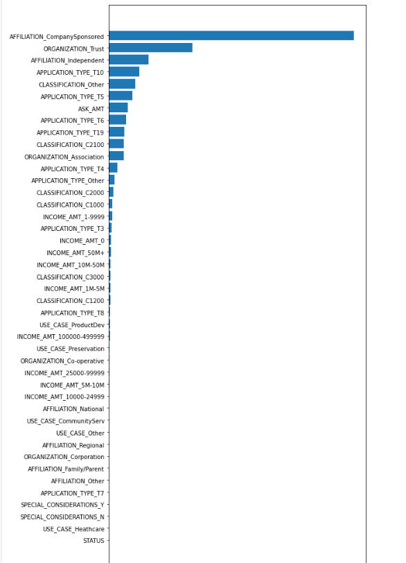

# Neural_Network_Charity_Analysis
## Overview of the analysis
This analysis is to help analyze whether applicants have been successful after funded by Alphabet Soup based on the features in the provided dataset. Furthermore, we are hoping to create a binary classifier using Neural Network Machine Learning Model based on the provided datasets,by which the client can make investment decision accordingly.

## Results
# Data Preprocessing
- What variable(s) are considered the target(s) for your model?
  Column "IS_SUCCESSFUL" is considered the target for the model.

- What variable(s) are considered to be the features for your model?
I tried the Gradient boosting classifier on the dataset and figured out the feature importance. Please see feature importance image below. The columns showing somewhat relevancy are below:

    - APPLICATION_TYPE
    - AFFILIATION         
    - CLASSIFICATION      
    - USE_CASE            
    - ORGANIZATION        
    - INCOME_AMT
    - ASK_AMT     

- What variable(s) are neither targets nor features, and should be removed from the input data?
  We dropped "STATUS" and 'SPECIAL_CONSIDERATIONS'due to the least important features after feature importance analysis.

# Compiling, Training, and Evaluating the Model
- How many neurons, layers, and activation functions did you select for your neural network model, and why?
  I tried a function to find out the optimized combination of activation function and number of layers. It turns out that sigmoid function with 3 hidden layers seem to have the best accuracy score. 

- What steps did you take to try and increase model performance?
    - First attempt: I dropped the non-relative columns ['SPECIAL_CONSIDERATIONS','STATUS'] based on the feature importance analysis, the accuracy score becomes 0.7264139, which is slightly higher than before (0.725597), but still didn't make the 75% target performance.
    - Second attempt: I re-grouped the ['AFFILIATION','ORGANIZATION'] to reduce the rare occurrence of some values. But still the accuracy score remains at the same level - 0.725247.
    - Third attempt: At the first and second attempts, I used 2 hidden layers, which 80 and 30 neurons for each layer, as well as 'Relu' activation function for the model. So when comes to the third attempt, I tried a function which can help me define the best possible combination of activation function and number of layers. The result of the function shows that the best possible combination is to us "Sigmoid" with 3 hidden layers. 
      With update of the activation function and number of layers and epochs, the model accuracy score remains at the same level - 0.724431.

- Were you able to achieve the target model performance?
 Unfortunately, after dropping the noise columns, regroup the column for fewer rare occurrence values and experiment of different activation and layers of the model, we still didn't increase the accuracy score to the target performance - 75%.

## Summary
  Overall, the deep learning model has an average of 72.5% accuracy score during the multiple attempts, but still we missed the target model performance score - 75%. The potential cause of the problem is that, some of the feature variables are showing skewed distribution or with noises in the data distribution. Even the importance within each feature varies quite a lot, it's not easy to regroup them by a consistent standard to eliminate the impact of the noise, and further interpret the model in a reasonable way. 
  The recommendation would be to further break down the pattern of each features and try to eliminate the noise from the feature datasets to improve the accuracy score of the deep learning model.

